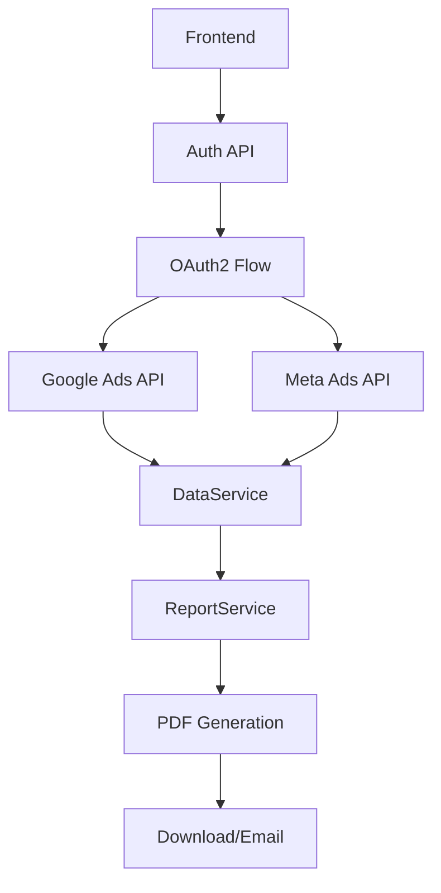

# Integração com APIs - Google Ads e Meta Ads

## 🔧 Configuração do Backend

### Variáveis de Ambiente Necessárias

Crie um arquivo `.env.local` na raiz do projeto com as seguintes variáveis:

```env
# Google Ads API Configuration
GOOGLE_ADS_CLIENT_ID=your_google_ads_client_id
GOOGLE_ADS_CLIENT_SECRET=your_google_ads_client_secret
GOOGLE_ADS_DEVELOPER_TOKEN=your_google_ads_developer_token
GOOGLE_ADS_REDIRECT_URI=http://localhost:3000/auth/google/callback

# Meta Ads API Configuration
META_ADS_APP_ID=your_meta_ads_app_id
META_ADS_APP_SECRET=your_meta_ads_app_secret
META_ADS_REDIRECT_URI=http://localhost:3000/auth/meta/callback

# Public Environment Variables (for client-side)
NEXT_PUBLIC_GOOGLE_ADS_CLIENT_ID=your_google_ads_client_id
NEXT_PUBLIC_GOOGLE_ADS_REDIRECT_URI=http://localhost:3000/auth/google/callback
NEXT_PUBLIC_META_ADS_APP_ID=your_meta_ads_app_id
NEXT_PUBLIC_META_ADS_REDIRECT_URI=http://localhost:3000/auth/meta/callback
```

## 🔐 Google Ads API

### 1. Configuração Inicial

1. **Criar Conta de Desenvolvedor:**
   - Acesse [Google Ads API Center](https://developers.google.com/google-ads/api/docs/first-call/overview)
   - Crie uma conta de desenvolvedor

2. **Configurar Projeto no Google Cloud:**
   - Acesse [Google Cloud Console](https://console.cloud.google.com/)
   - Crie um novo projeto ou selecione existente
   - Ative a API do Google Ads
   - Configure OAuth 2.0 credentials

3. **Obter Token de Desenvolvedor:**
   - Acesse sua conta de gerente no Google Ads
   - Vá para "Centro de API" nas configurações
   - Solicite um token de desenvolvedor

### 2. Implementação

```typescript
// Exemplo de uso do Google Ads API
import { GoogleAdsApi } from 'google-ads-api';

const client = new GoogleAdsApi({
  client_id: process.env.GOOGLE_ADS_CLIENT_ID,
  client_secret: process.env.GOOGLE_ADS_CLIENT_SECRET,
  developer_token: process.env.GOOGLE_ADS_DEVELOPER_TOKEN,
});

const customer = client.Customer({
  customer_id: '1234567890',
  refresh_token: 'refresh_token_here',
});

// Buscar campanhas
const campaigns = await customer.query(`
  SELECT campaign.id, campaign.name, metrics.impressions, metrics.clicks
  FROM campaign
  WHERE segments.date BETWEEN '2024-01-01' AND '2024-01-31'
`);
```

## 📱 Meta Ads API

### 1. Configuração Inicial

1. **Criar Aplicativo:**
   - Acesse [Meta for Developers](https://developers.facebook.com/)
   - Crie um novo aplicativo do tipo "Business"

2. **Configurar OAuth 2.0:**
   - No painel do aplicativo, vá em "Configurações" > "Básico"
   - Obtenha o ID do aplicativo e a chave secreta
   - Configure URIs de redirecionamento OAuth

3. **Obter Token de Acesso:**
   - Crie um usuário do sistema no [Business Manager](https://business.facebook.com/)
   - Gere um token de acesso com permissões `ads_read` e `business_management`

### 2. Implementação

```typescript
// Exemplo de uso do Meta Marketing API
import { FacebookAdsApi, AdAccount } from 'facebook-nodejs-business-sdk';

const api = FacebookAdsApi.init(
  process.env.META_ADS_APP_ID,
  process.env.META_ADS_APP_SECRET,
  process.env.META_ADS_ACCESS_TOKEN
);

const adAccount = new AdAccount('act_1234567890');
const campaigns = await adAccount.getCampaigns([
  'id', 'name', 'status', 'daily_budget'
]);
```

## 🚀 Estrutura do Backend

### Serviços Implementados

1. **AuthService** (`/src/services/authService.ts`)
   - Gerenciamento de autenticação OAuth2
   - Tokens de acesso e refresh
   - Status das conexões

2. **DataService** (`/src/services/dataService.ts`)
   - Coleta de dados das APIs
   - Processamento e formatação
   - Conversão para KPIs

3. **ReportService** (`/src/services/reportService.ts`)
   - Geração de relatórios
   - Templates configuráveis
   - Metadados estruturados

### APIs Implementadas

1. **Auth API** (`/src/api/auth.ts`)
   - Iniciar autenticação OAuth2
   - Processar callbacks
   - Verificar status das conexões

2. **Reports API** (`/src/api/reports.ts`)
   - Gerar relatórios
   - Coletar dados de campanhas
   - Sincronizar dados

### Hooks para Frontend

1. **useAuth** (`/src/hooks/useAuth.ts`)
   - Gerenciar autenticação
   - Status das conexões
   - Callbacks OAuth2

2. **useReports** (`/src/hooks/useReports.ts`)
   - Gerar relatórios
   - Carregar histórico
   - Sincronizar dados

## 📊 Fluxo de Dados



## 🔒 Segurança

### Boas Práticas Implementadas

1. **Tokens Seguros:**
   - Armazenamento seguro de tokens
   - Renovação automática de refresh tokens
   - Validação de expiração

2. **OAuth2 Flow:**
   - PKCE para segurança adicional
   - Scopes mínimos necessários
   - Validação de estado

3. **Rate Limiting:**
   - Controle de taxa de requisições
   - Retry automático com backoff
   - Monitoramento de limites

## 🧪 Testes

### Dados Mockados para MVP

O sistema inclui dados mockados realistas para desenvolvimento e testes:

- **Google Ads:** Campanhas, métricas e contas simuladas
- **Meta Ads:** Campanhas, métricas e contas simuladas
- **Relatórios:** KPIs, insights e gráficos de exemplo

### Como Usar em Desenvolvimento

1. Configure as variáveis de ambiente
2. Use os dados mockados para desenvolvimento
3. Implemente as integrações reais em produção

## 📈 Próximos Passos

1. **Implementar Backend Real:**
   - API routes com Next.js
   - Banco de dados para tokens
   - Cache de dados

2. **Melhorar Segurança:**
   - Criptografia de tokens
   - Validação de permissões
   - Logs de auditoria

3. **Otimizar Performance:**
   - Cache inteligente
   - Processamento assíncrono
   - Compressão de dados

4. **Monitoramento:**
   - Logs estruturados
   - Métricas de performance
   - Alertas de erro
