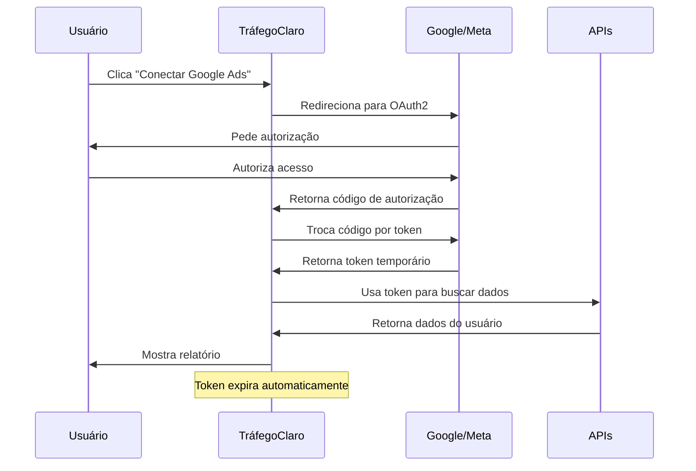

# 🔒 Segurança e Privacidade - TráfegoClaro

## **Por que o usuário conecta a própria conta?**

### **1. Dados Reais e Personalizados**
- **Acesso direto**: O usuário acessa seus próprios dados de campanhas
- **Sem intermediários**: Não precisamos gerenciar contas de terceiros
- **Dados atualizados**: Informações sempre em tempo real

### **2. Segurança e Compliance**
- **Privacidade**: Cada usuário vê apenas seus próprios dados
- **Políticas das plataformas**: Respeitamos as regras do Google e Meta
- **Controle do usuário**: Ele pode desconectar a qualquer momento

### **3. Escalabilidade**
- **Sem limitações**: Não há limite de contas para gerenciar
- **Custo zero**: Não precisamos de infraestrutura para armazenar dados
- **Manutenção mínima**: As plataformas cuidam da autenticação

## **🔐 Como Funciona a Segurança**

### **Fluxo OAuth2 Seguro**



### **1. Autenticação OAuth2**
- **PKCE (Proof Key for Code Exchange)**: Proteção adicional contra ataques
- **State parameter**: Previne ataques CSRF
- **Scopes mínimos**: Apenas permissões necessárias
- **Tokens temporários**: Expiração automática

### **2. Armazenamento Temporário**
- **Memória apenas**: Tokens ficam em memória durante a sessão
- **Sem banco de dados**: Nada é salvo permanentemente
- **Expiração automática**: Tokens expiram em 1 hora
- **Limpeza automática**: Dados são removidos ao fechar o navegador

### **3. Comunicação Segura**
- **HTTPS obrigatório**: Todas as comunicações são criptografadas
- **Headers de segurança**: CORS e CSP configurados
- **Validação de origem**: Apenas domínios autorizados

## **🛡️ Medidas de Segurança Implementadas**

### **1. Validação de Tokens**
```typescript
// Verificar se token é válido antes de usar
const isValidToken = (token: string, expiresAt: number): boolean => {
  return token && Date.now() < expiresAt;
};
```

### **2. Limpeza Automática**
```typescript
// Tokens são removidos automaticamente quando expiram
if (Date.now() > token.expiresAt) {
  delete this.tokens[platform];
}
```

### **3. Validação de Estado OAuth2**
```typescript
// Prevenir ataques CSRF
if (state !== this.sessionId) {
  throw new Error('Invalid state parameter - possible CSRF attack');
}
```

### **4. Scopes Mínimos**
- **Google Ads**: `https://www.googleapis.com/auth/adwords`
- **Meta Ads**: `ads_read,business_management`
- **Apenas leitura**: Não modificamos campanhas

## **📋 O que o Usuário Autoriza**

### **Google Ads**
- ✅ **Ler dados de campanhas**: Nome, status, orçamento
- ✅ **Ler métricas**: Impressões, cliques, custo, conversões
- ✅ **Ler informações da conta**: ID, nome, moeda
- ❌ **Modificar campanhas**: Não alteramos nada
- ❌ **Criar campanhas**: Não criamos nada
- ❌ **Deletar dados**: Não removemos nada

### **Meta Ads**
- ✅ **Ler dados de campanhas**: Nome, status, orçamento
- ✅ **Ler métricas**: Impressões, cliques, gastos, conversões
- ✅ **Ler informações da conta**: ID, nome, moeda
- ❌ **Modificar campanhas**: Não alteramos nada
- ❌ **Criar campanhas**: Não criamos nada
- ❌ **Deletar dados**: Não removemos nada

## **🔍 Transparência para o Usuário**

### **1. Informações Claras**
- **O que fazemos**: Explicamos exatamente o que acessamos
- **Por que precisamos**: Justificamos cada permissão
- **Como protegemos**: Mostramos as medidas de segurança

### **2. Controle Total**
- **Conectar/Desconectar**: A qualquer momento
- **Ver dados**: O usuário vê exatamente o que acessamos
- **Revogar acesso**: Pode revogar nas configurações da plataforma

### **3. Sem Surpresas**
- **Sem dados salvos**: Nada fica armazenado permanentemente
- **Sem compartilhamento**: Dados não são compartilhados com terceiros
- **Sem rastreamento**: Não rastreamos o usuário além do necessário

## **⚖️ Compliance e Regulamentações**

### **1. LGPD (Lei Geral de Proteção de Dados)**
- **Minimização**: Coletamos apenas dados necessários
- **Finalidade**: Dados usados apenas para gerar relatórios
- **Transparência**: Usuário sabe exatamente o que acontece
- **Controle**: Usuário pode revogar acesso a qualquer momento

### **2. Políticas das Plataformas**
- **Google Ads API**: Seguimos todas as diretrizes
- **Meta Marketing API**: Respeitamos as políticas
- **Rate Limiting**: Respeitamos limites de requisições
- **Uso adequado**: Apenas para fins comerciais legítimos

## **🚨 Resposta a Incidentes**

### **1. Token Comprometido**
- **Detecção automática**: Verificamos expiração
- **Limpeza imediata**: Removemos tokens inválidos
- **Notificação**: Informamos o usuário se necessário

### **2. Erro de Autenticação**
- **Fallback seguro**: Usamos dados mockados
- **Logs seguros**: Registramos apenas erros técnicos
- **Recuperação**: Usuário pode reconectar facilmente

### **3. Suspeita de Ataque**
- **Validação de estado**: Verificamos parâmetros OAuth2
- **Bloqueio temporário**: Limitamos tentativas de conexão
- **Análise de logs**: Investigamos padrões suspeitos

## **✅ Benefícios da Abordagem**

### **Para o Usuário**
- **Controle total**: Decide quando conectar/desconectar
- **Dados reais**: Relatórios com informações atualizadas
- **Privacidade**: Dados não são salvos permanentemente
- **Transparência**: Sabe exatamente o que acontece

### **Para o TráfegoClaro**
- **Sem infraestrutura**: Não precisa gerenciar dados
- **Escalabilidade**: Suporta qualquer número de usuários
- **Compliance**: Respeita todas as regulamentações
- **Manutenção mínima**: Plataformas cuidam da autenticação

### **Para as Plataformas**
- **Uso legítimo**: Apenas para fins comerciais
- **Políticas respeitadas**: Seguimos todas as diretrizes
- **Rate limiting**: Respeitamos limites de API
- **Segurança**: Implementamos todas as boas práticas

## **🔧 Configuração de Segurança**

### **Variáveis de Ambiente**
```env
# URLs de callback seguras
GOOGLE_ADS_REDIRECT_URI=https://trafegoclaro.com/auth/google/callback
META_ADS_REDIRECT_URI=https://trafegoclaro.com/auth/meta/callback

# Apenas em produção
NODE_ENV=production
```

### **Headers de Segurança**
```typescript
// Configurações de segurança
const securityHeaders = {
  'Strict-Transport-Security': 'max-age=31536000',
  'X-Frame-Options': 'DENY',
  'X-Content-Type-Options': 'nosniff',
  'Referrer-Policy': 'strict-origin-when-cross-origin'
};
```

Esta abordagem garante máxima segurança, privacidade e transparência para o usuário, enquanto mantém a simplicidade e escalabilidade do sistema.
